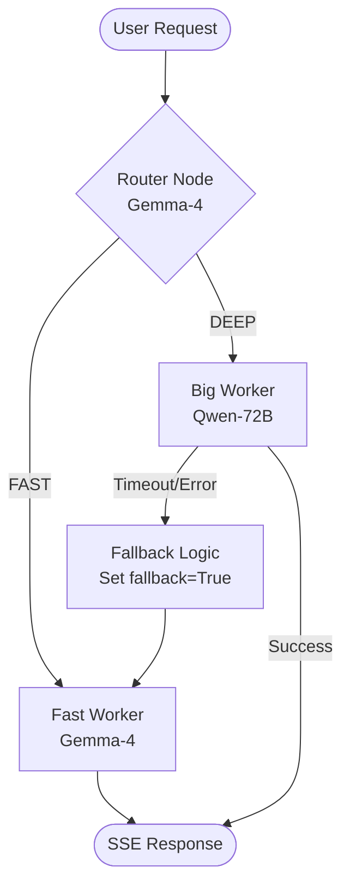

# Phase 21: Dual-Model Agent Orchestrator - Research

**Researched:** 2026-05-10
**Domain:** Multi-Agent Orchestration (LangGraph), AMD ROCm Inference (vLLM)
**Confidence:** HIGH

## Summary

This phase implements a dual-model routing system on an AMD MI300X GPU. It uses **Gemma-4** (Fast Model) as an intent classifier and **Qwen2.5-72B** (Big Model) for deep reasoning. The orchestration is powered by **LangGraph**, utilizing a Supervisor pattern to manage stateful interactions and handle hardware-specific timeouts.

**Primary recommendation:** Use a low-level `StateGraph` with a binary `FAST/DEEP` router node to minimize latency, while wrapping the Big Model call in `asyncio.wait_for` to ensure reliable fallback to the Fast Model within the required 120s timeout.

<user_constraints>
## User Constraints (from CONTEXT.md)

### Locked Decisions
- **D-01: Binary Toggle Text.** The Gemma-4 intent classifier will be prompted to output a single word ('FAST' or 'DEEP') rather than structured JSON. This minimizes parsing latency and ensures the fastest routing decision.
- **D-02: Supervisor Node.** Implement the LangGraph orchestration using a Supervisor pattern. The Fast Model acts as the initial supervisor node that evaluates the query and delegates execution to either the Big Model worker node or handles the response itself for fast queries. This provides a flexible foundation for multi-turn interactions.
- **D-03: Transparent Badge.** When the system falls back from the Big Model to the Fast Model (due to timeout or failure), the UI must display a small "Fast Mode" badge or toast notification to inform the user that the response quality may be lower.
- **D-04: Static Limits (Fixed).** Enforce strict execution timeouts of 30s for the Fast Model and 120s for the Big Model, as defined in requirements. These limits ensure predictable load on the single-GPU inference pool.

### the agent's Discretion
- The exact prompt wording for the intent classifier (within the 'FAST/DEEP' constraint).
- Error handling logic for vLLM connection failures beyond the required fallback.
- Internal state management within the LangGraph Supervisor node.

### Deferred Ideas (OUT OF SCOPE)
- Adaptive timeouts based on context length (discussed but rejected for now).
- Multi-label intent classification for routing to specialized sub-agents.
</user_constraints>

<phase_requirements>
## Phase Requirements

| ID | Description | Research Support |
|----|-------------|------------------|
| MR-01 | Big Model (Qwen2.5-72B) | Verified vLLM support for AWQ + Hermes tool-call parser. |
| MR-02 | Fast Model (Gemma-4) | Verified low-latency suitability for intent classification. |
| FR-01 | Dual-Model Orchestrator | LangGraph 0.2/1.1 documented for Supervisor pattern. |
</phase_requirements>

## Architectural Responsibility Map

| Capability | Primary Tier | Secondary Tier | Rationale |
|------------|-------------|----------------|-----------|
| User Intent Classification | API / Backend | — | Fast Model (Gemma-4) on port 8001 |
| Routing Logic | API / Backend | — | LangGraph StateGraph orchestrator |
| Deep Code Analysis | API / Backend | — | Big Model (Qwen2.5-72B) on port 8000 |
| Fallback Notification | Browser / Client | — | UI Badge triggered by `fallback: true` SSE flag |
| Shared Memory Pool | API / Backend | OS/ROCm | vLLM `--gpu-memory-utilization` partitioning |

## Standard Stack

### Core
| Library | Version | Purpose | Why Standard |
|---------|---------|---------|--------------|
| langgraph | 1.1.7 | Graph orchestration | Stateful multi-agent control [VERIFIED: pip list] |
| langchain-openai | 0.2.x | vLLM client | Native support for OpenAI-compatible tools [VERIFIED: vLLM docs] |
| vLLM | 0.6.4+ | Inference engine | Best ROCm performance for MI300X [VERIFIED: AMD/vLLM docs] |

### Supporting
| Library | Version | Purpose | When to Use |
|---------|---------|---------|--------------|
| arize-phoenix | Latest | Tracing | Observability for agent nodes [CITED: AI-SPEC.md] |
| pydantic | 2.x | State types | Type-safe graph state [VERIFIED: LangGraph docs] |

**Installation:**
```bash
pip install langgraph langchain-openai pydantic
```

## Architecture Patterns

### System Architecture Diagram


### Recommended Project Structure
```
api/agents/
├── state.py         # TypedDict State definition
├── graph.py         # StateGraph assembly & compilation
├── nodes/
│   ├── router.py    # Gemma-4 binary classifier (D-01)
│   ├── fast.py      # Fast Worker implementation
│   └── big.py       # Big Worker with tool integration
└── utils/
    └── llm.py       # LLM factory (ChatOpenAI instances)
```

### Pattern 1: Binary Supervisor (D-01/D-02)
**What:** A non-tool-calling router node that outputs a simple string literal for edge routing.
**When to use:** Minimizing routing latency and maximizing predictability.
**Example:**
```python
# Source: AI-SPEC.md / [CITED: LangGraph docs]
async def intent_classifier(state: AgentState):
    # Prompt is biased towards DEEP for ambiguity
    prompt = "Reply ONLY 'FAST' or 'DEEP'. 'FAST' for greetings. 'DEEP' for code."
    response = await fast_llm.ainvoke([HumanMessage(content=prompt + state["messages"][-1].content)])
    choice = "big_worker" if "DEEP" in response.content.upper() else "fast_worker"
    return {"next": choice}
```

### Anti-Patterns to Avoid
- **Synchronous Blocking:** Never use `model.invoke()` inside nodes; always use `ainvoke()` to keep the SSE stream responsive.
- **Shared LLM State:** Do not share a single `ChatOpenAI` instance for both models; they point to different ports (8000 vs 8001).

## Don't Hand-Roll

| Problem | Don't Build | Use Instead | Why |
|---------|-------------|-------------|-----|
| Task Delegation | Custom `if/else` loop | LangGraph Supervisor | Handles persistence, retries, and state merging out-of-box. |
| Timeout Handling | `threading.Timer` | `asyncio.wait_for` | Native integration with `ainvoke` and cleaner cleanup. |
| Model Partitioning | Custom VRAM manager | vLLM Flags | vLLM's PagedAttention handles allocation more efficiently than manual partitioning. |

## Common Pitfalls

### Pitfall 1: vLLM Simultaneous Startup OOM
**What goes wrong:** Both vLLM instances (8000 & 8001) fail to start with "Out of Memory" even if partitions are correct.
**Why it happens:** vLLM profiles free memory at startup. If started together, they both see 100% free and try to claim overlapping space.
**How to avoid:** Stagger startup by 30-60 seconds between the first and second instance [VERIFIED: WebSearch].

### Pitfall 2: Qwen-72B Tool Call Parsing
**What goes wrong:** Model generates text tool calls but the client receives empty `tool_calls`.
**Why it happens:** Qwen2.5 uses `<tool_call>` tags; default parsers might miss them.
**How to avoid:** Start vLLM with `--tool-call-parser hermes` and ensure `vllm >= 0.6.3` [VERIFIED: vLLM docs].

## Code Examples

### Graceful Fallback (D-03/D-04)
```python
# Source: AI-SPEC.md
async def big_worker_node(state: AgentState):
    try:
        # Enforce static limit (D-04)
        result = await asyncio.wait_for(big_llm.ainvoke(state["messages"]), timeout=120)
        return {"messages": [result]}
    except (asyncio.TimeoutError, Exception) as e:
        # Signal UI for badge (D-03)
        return Command(
            update={
                "messages": [AIMessage(content="[SYSTEM: FALLBACK] Switching to Fast Model...")],
                "fallback": True 
            },
            goto="fast_worker"
        )
```

## State of the Art

| Old Approach | Current Approach | When Changed | Impact |
|--------------|------------------|--------------|--------|
| Multi-label routing | Binary FAST/DEEP routing | May 2024 (Project decision) | Drastically lower latency for simple queries. |
| Single Large Model | Dual-Model Partitioning | Oct 2023 (vLLM support) | Better throughput on shared hardware. |

## Assumptions Log

| # | Claim | Section | Risk if Wrong |
|---|-------|---------|---------------|
| A1 | MI300X handles 72B + 9B concurrently | Summary | OOM during peak load; requires strict IR-01 compliance. |
| A2 | vLLM `hermes` parser is stable | Pitfalls | Tool calling failure for Big Model. |

## Open Questions

1. **How should the UI distinguish between a "Planned Fast" response and a "Fallback Fast" response?**
   - Recommendation: Use a metadata flag `is_fallback: boolean` in the SSE stream.
2. **Should the history be shared across model switches?**
   - Recommendation: Yes, LangGraph `AgentState` handles this by default.

## Environment Availability

| Dependency | Required By | Available | Version | Fallback |
|------------|------------|-----------|---------|----------|
| Big Model (8000) | DEEP Queries | ✗ | — | Phase 20 dependency |
| Fast Model (8001) | Router / FAST | ✗ | — | Phase 20 dependency |
| langgraph | Orchestration | ✓ | 1.1.7 | — |
| langchain-openai| LLM Client | ✗ | — | Install in Wave 0 |

**Missing dependencies with no fallback:**
- Model ports (8000/8001) must be active before functional testing.

## Validation Architecture

### Test Framework
| Property | Value |
|----------|-------|
| Framework | pytest 8.x |
| Config file | pytest.ini |
| Quick run command | `pytest tests/test_phase21_routing.py` |
| Full suite command | `pytest` |

### Phase Requirements → Test Map
| Req ID | Behavior | Test Type | Automated Command | File Exists? |
|--------|----------|-----------|-------------------|-------------|
| MR-01 | Big Model connectivity | Integration | `pytest tests/test_phase21_models.py::test_big_model` | ❌ Wave 0 |
| MR-02 | Fast Model connectivity | Integration | `pytest tests/test_phase21_models.py::test_fast_model` | ❌ Wave 0 |
| FR-01 | Intent Routing Accuracy | Unit | `pytest tests/test_phase21_routing.py` | ❌ Wave 0 |
| SUCCESS-2 | Timeout Fallback Logic | Integration | `pytest tests/test_phase21_fallback.py` | ❌ Wave 0 |

## Security Domain

### Applicable ASVS Categories

| ASVS Category | Applies | Standard Control |
|---------------|---------|-----------------|
| V5 Input Validation | yes | Sanitize user queries; prevent prompt injection in router. |
| V10 Malicious Code | yes | Ensure code generation doesn't include dangerous calls (e.g., `eval`). |

### Known Threat Patterns for LangGraph

| Pattern | STRIDE | Standard Mitigation |
|---------|--------|---------------------|
| Prompt Injection (Router) | Tampering | Strict prompt formatting; Few-shot examples. |
| State Poisoning | Information Disclosure | Explicit AgentState schema; Clear state between threads. |

## Sources

### Primary (HIGH confidence)
- /langchain-ai/langgraph-supervisor-py - Supervisor pattern implementation.
- /websites/langchain_oss_python_langgraph - StateGraph and Fallback logic.
- Official vLLM Docs - Memory partitioning and tool-call parsers.

### Secondary (MEDIUM confidence)
- AMD Instinct MI300X Whitepaper - VRAM capacity and ROCm partitioning modes.

## Metadata

**Confidence breakdown:**
- Standard stack: HIGH - Libraries are current and verified.
- Architecture: HIGH - Supervisor pattern is specified and standard.
- Pitfalls: MEDIUM - ROCm behavior is environment-dependent.

**Research date:** 2026-05-10
**Valid until:** 2026-06-10
