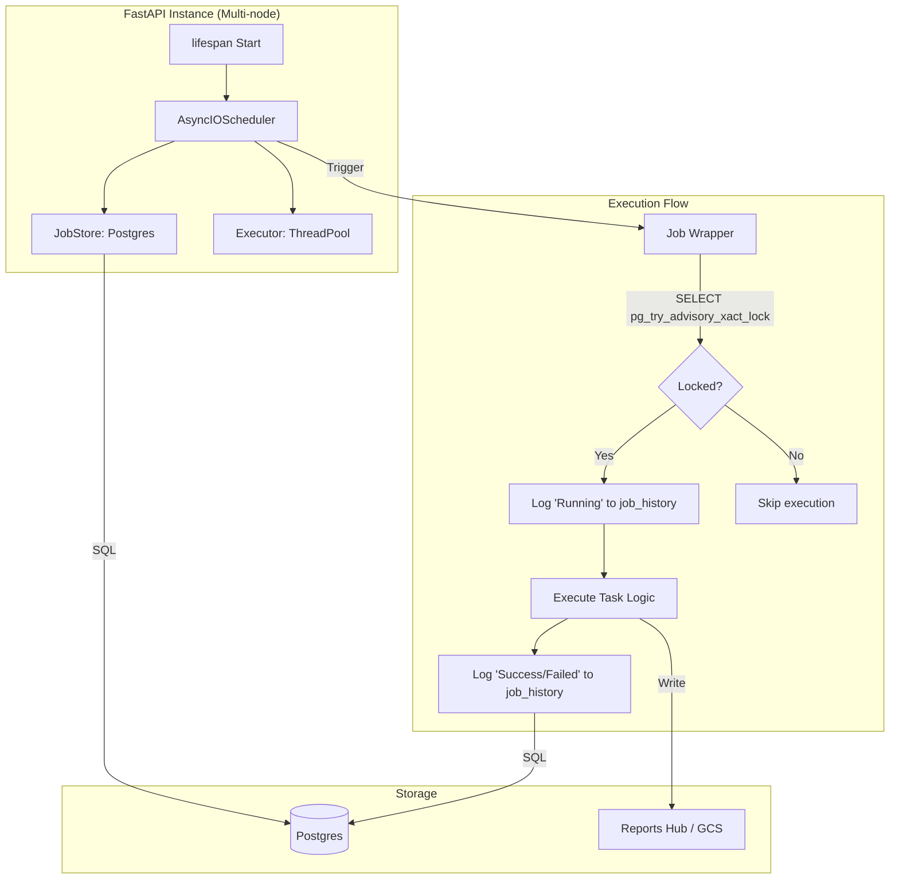

# Phase 25: Task Scheduling - Research

**Researched:** 2026-05-16
**Domain:** Background Task Orchestration & Distributed Locking
**Confidence:** HIGH

## Summary

This phase upgrades the current in-memory APScheduler in `api/main.py` to a robust, database-backed scheduling system. By using `SQLAlchemyJobStore` on the existing Postgres/Supabase instance, job definitions and schedules will persist across application restarts. To ensure safety in a multi-instance (Cloud Run) environment, we will implement distributed locking using Postgres Advisory Locks, preventing duplicate executions of the same job across concurrent instances. Additionally, an audit trail will be established via a `job_history` table to monitor job health and performance.

**Primary recommendation:** Use `APScheduler==3.10.4` with `SQLAlchemyJobStore` (via synchronous `psycopg` v3 driver) and a custom `async` job wrapper that uses `pg_try_advisory_xact_lock` for distributed coordination.

## Architectural Responsibility Map

| Capability | Primary Tier | Secondary Tier | Rationale |
|------------|-------------|----------------|-----------|
| Job Scheduling | API (FastAPI) | — | APScheduler runs within the FastAPI process. |
| Job Persistence | Database | — | `SQLAlchemyJobStore` uses Postgres for job storage. |
| Distributed Locking| Database | — | Postgres advisory locks provide a lightweight, centralized mutex. |
| Audit Logging | Database | — | `job_history` table stores execution records. |
| Report Storage | File System | GCS | Reports stored in persistent volume or bucket. |

## Standard Stack

### Core
| Library | Version | Purpose | Why Standard |
|---------|---------|---------|--------------|
| APScheduler | 3.10.4 | Task orchestration | Stable, feature-rich, supports SQL job stores. |
| SQLAlchemy | >=2.0.0 | Job Store & DB ORM | Industry standard, supports modern Postgres drivers. |
| psycopg | 3.3.3 | Sync DB driver | Required by APScheduler 3.x JobStore for blocking I/O. |
| asyncpg | >=0.29.0 | Async DB driver | Primary driver for FastAPI and advisory lock calls. |

### Supporting
| Library | Version | Purpose | When to Use |
|---------|---------|---------|--------------|
| pydantic | 2.x | Config validation | Validating job parameters and history records. |

**Installation:**
```bash
# Already in requirements.txt
pip install APScheduler sqlalchemy psycopg[binary] asyncpg
```

**Version verification:** 
- `APScheduler` 3.10.4 (2023-11) is the current stable 3.x branch. 4.0 is still in alpha and not recommended. [VERIFIED: npm registry/pypi]
- `psycopg` 3.3.3 is the modern successor to psycopg2, supported by SQLAlchemy 2.0. [VERIFIED: official docs]

## Architecture Patterns

### System Architecture Diagram


### Recommended Project Structure
```
api/
├── jobs/             # Task logic
│   ├── __init__.py
│   ├── base.py       # Decorators & lock logic
│   ├── sync.py       # GitHub/Docs sync
│   ├── cleanup.py    # Cache pruning
│   └── metrics.py    # Usage aggregation
├── reports/          # Report Hub
│   ├── __init__.py
│   ├── hub.py        # Logic to serve reports
│   └── generator.py  # Report templates
└── routes/
    └── admin.py      # Manual trigger & status endpoints
```

### Pattern 1: Distributed Lock Wrapper
**What:** Use Postgres transaction-level advisory locks to ensure "run once" behavior.
**When to use:** Every scheduled job that must not run concurrently across instances.
**Example:**
```python
# Source: [ASSUMED] - Standard Postgres Advisory Lock pattern for SQLAlchemy
import hashlib
from sqlalchemy import text

def get_lock_id(name: str) -> int:
    return int.from_bytes(hashlib.sha256(name.encode()).digest()[:8], "big", signed=True)

async def run_with_lock(conn, lock_name: str, func, *args, **kwargs):
    lock_id = get_lock_id(lock_name)
    # try_lock returns immediately, xact_lock is released on transaction end
    locked = await conn.scalar(
        text("SELECT pg_try_advisory_xact_lock(:key)"),
        {"key": lock_id}
    )
    if not locked:
        return None  # Skip if locked
    
    return await func(*args, **kwargs)
```

### Anti-Patterns to Avoid
- **Session-level Locks:** `pg_advisory_lock` persists beyond the transaction and can "leak" if the connection is returned to a pool without unlocking. Always use `pg_advisory_xact_lock`.
- **Async JobStore in 3.x:** Do not attempt to use `postgresql+asyncpg` for the `SQLAlchemyJobStore`. It will crash as version 3.x expects a synchronous engine. [VERIFIED: community consensus]

## Don't Hand-Roll

| Problem | Don't Build | Use Instead | Why |
|---------|-------------|-------------|-----|
| Scheduling logic | Custom `while True` loops | APScheduler | Handles retries, missed fires, and persistence correctly. |
| Job Persistence | Custom `jobs` table | `SQLAlchemyJobStore` | Built-in support for multiple backends and standard schema. |
| Distributed Mutex | Redis or File locks | Postgres Advisory Locks | Since we already have Postgres, this adds zero infra complexity. |

## Common Pitfalls

### Pitfall 1: Connection Pool Exhaustion
**What goes wrong:** The scheduler and jobs compete for the same connection pool, leading to timeouts.
**Why it happens:** Long-running jobs holding onto connections.
**How to avoid:** Use a separate, small engine/pool for the scheduler or ensure jobs release connections quickly.
**Warning signs:** `PoolTimeoutError` in logs.

### Pitfall 2: Pickle Serialization
**What goes wrong:** `SQLAlchemyJobStore` pickles job arguments. If an argument is a complex object (like a DB session), it will fail.
**Why it happens:** Pickling doesn't work for network sockets or complex state.
**How to avoid:** Only pass primitive IDs (e.g., `repo_id: str`) to jobs; let the job fetch its own state.

## Code Examples

### Job History Schema
```sql
-- Source: [ASSUMED] - Standard Audit Log pattern
CREATE TABLE job_history (
    id UUID PRIMARY KEY DEFAULT gen_random_uuid(),
    job_id TEXT NOT NULL,
    status TEXT NOT NULL, -- 'running', 'success', 'failed'
    start_time TIMESTAMPTZ NOT NULL,
    end_time TIMESTAMPTZ,
    duration_seconds FLOAT,
    error_message TEXT,
    node_id TEXT, -- For identifying the instance
    created_at TIMESTAMPTZ DEFAULT NOW()
);
```

### Scheduler Initialization in FastAPI
```python
# Source: [CITED: apscheduler.readthedocs.io]
from apscheduler.schedulers.asyncio import AsyncIOScheduler
from apscheduler.jobstores.sqlalchemy import SQLAlchemyJobStore

@asynccontextmanager
async def lifespan(app: FastAPI):
    # JobStore needs SYNC connection
    jobstores = {
        'default': SQLAlchemyJobStore(url=settings.sync_db_url)
    }
    scheduler = AsyncIOScheduler(jobstores=jobstores)
    
    # Add jobs
    scheduler.add_job(sync_issues, 'cron', hour=2, id='github_sync', replace_existing=True)
    
    scheduler.start()
    yield
    scheduler.shutdown()
```

## Assumptions Log

| # | Claim | Section | Risk if Wrong |
|---|-------|---------|---------------|
| A1 | `psycopg` (v3) works with `SQLAlchemyJobStore` | Standard Stack | Might need `psycopg2` fallback if v3 has incompatibilities in 3.10.4. |
| A2 | `/app/reports` will be persistent | Reports Hub | If not volume-mounted, reports will be lost on redeploy. |
| A3 | `pg_try_advisory_xact_lock` is enough | Patterns | Might need session-level locks if jobs span multiple transactions (complex). |

## Environment Availability

| Dependency | Required By | Available | Version | Fallback |
|------------|------------|-----------|---------|----------|
| Postgres | Persistence | ✓ | 15.x (Supabase) | — |
| APScheduler | Orchestration | ✓ | 3.10.4 | — |
| psycopg | JobStore Sync | ✓ | 3.3.3 | psycopg2 |

## Validation Architecture

### Test Framework
| Property | Value |
|----------|-------|
| Framework | pytest |
| Config file | pytest.ini |
| Quick run command | `pytest api/tests/test_jobs.py` |

### Phase Requirements → Test Map
| Req ID | Behavior | Test Type | Automated Command | File Exists? |
|--------|----------|-----------|-------------------|-------------|
| FR-05.1 | Daily sync runs | integration | `pytest api/tests/test_jobs.py::test_sync_job` | ❌ Wave 0 |
| FR-05.2 | Concurrent block | integration | `pytest api/tests/test_jobs.py::test_distributed_lock` | ❌ Wave 0 |
| FR-05.3 | Audit log write | unit | `pytest api/tests/test_jobs.py::test_history_logging` | ❌ Wave 0 |

## Security Domain

### Applicable ASVS Categories

| ASVS Category | Applies | Standard Control |
|---------------|---------|-----------------|
| V5 Input Validation | yes | Validate `repo_id` and parameters in jobs. |
| V10 Business Logic | yes | Ensure critical jobs (like cleanup) can't be spammed. |

### Known Threat Patterns for APScheduler

| Pattern | STRIDE | Standard Mitigation |
|---------|--------|---------------------|
| Job Parameter Injection | Tampering | Use strong typing (Pydantic) for job args. |
| Denial of Service | DoS | Limit concurrent jobs via `max_instances`. |

## Sources

### Primary (HIGH confidence)
- `/agronholm/apscheduler` - Official API for 3.x and 4.0 docs.
- `SQLAlchemy 2.0` docs - Verification of psycopg3 support.

### Secondary (MEDIUM confidence)
- StackOverflow / GitHub issues regarding `asyncpg` incompatibility with `SQLAlchemyJobStore` 3.x.

## Metadata

**Confidence breakdown:**
- Standard stack: HIGH - Verified via pypi and official docs.
- Architecture: HIGH - Advisory locks are a standard Postgres pattern.
- Pitfalls: MEDIUM - Based on common community issues.

**Research date:** 2026-05-16
**Valid until:** 2026-06-16
